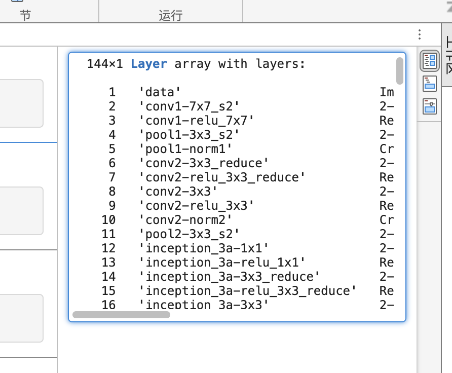

## 读取图片
* 1. 读取图片``img1 = imread("file01.jpg");``
* 2. 显示图片 `` imshow(img1) ``

## 图片分类
预训练网络 
 
 预训练网络 应该为已有训练好的神经网络，可以直接使用的网络模型(matlab online 可以 直接使用， 桌面版需要下载)。
 * 1.引用图片

 ``deepnet = googlenet``
 * 2. 分类
`` pred1 = classify(deepnet,img1) ``

* 3. 增加分类
pred2 = classify(deepnet,img2)
图片2 分类结果为`` 'Bernese mountain dog' ``
（实际是个cat ,不是 dog）

## CNN （Convolutional Neural Network）

* 1. 前面几层负责特征值计算,后面几层负责分类
* 2. 输出多个分类结果，并且给出可信度

查看网络层
像任何 CNN 一样，GoogLeNet 在 MATLAB 中表示为一个层数组。需要特别关注此数组的第一个和最后一个元素，它们分别代表输入层和输出层。

* 1. 获取 layers 的引用，赋值到 ly``ly = deepnet.Layers``
 144层

layers.png


* 2. 查看层参数
```
inlayer = ly(1);
insz = inlayer.InputSize;
```


```
outlayer = ly(144)
categorynames = outlayer.Classes
```

测试脚本

环境 ：  matlab online ，文件夹中需包含一个 test.png（224x224x3）； 因笔者下载图片大小为359x451x3 ，所以多了一个裁切步骤（imcrop）

```
img1 = imread("test.png");
% croppedImage = imcrop(originalImage, [x, y, width, height]);
img2 = imcrop(img1, [114, 39, 223, 223])
imshow(img2);
deepnet = googlenet;
pred1 = classify(deepnet,img2);

```

